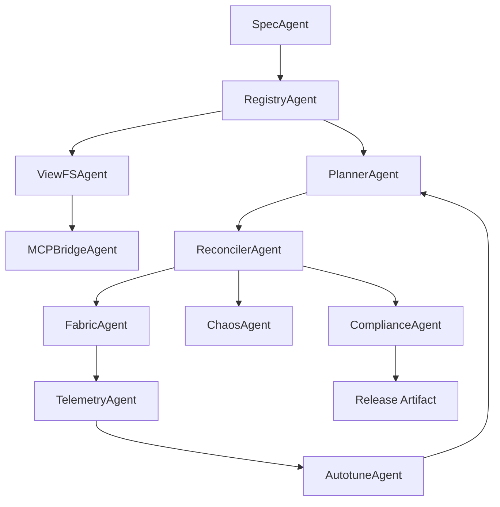

Below is the complete PRD for your Relay Terminal Tool (RTT) with MCP integration, content-addressed registry, virtual provider views, and fully automated build-operate loops. It folds in your existing drop-ins and upgrades them to the top-tier pattern.

# Product Requirements Document — Relay Terminal Tool (RTT)

## 0) One-line intent

Local, deterministic connection fabric that discovers symbols, solves routes, wires lanes, and hot-swaps endpoints across multi-agent, multi-provider stacks without duplication.

## 1) Objectives

* Zero duplication of agents and tools across providers.
* Instant connect, disconnect, and reconnection with SLO guarantees.
* Deterministic plans, signed and reversible.
* Fully offline and local-first.
* Extensible via drivers with strict capability security.

## 2) Non-goals

* Cloud dependency.
* Hidden background network calls.
* Per-provider forks of agent files.

## 3) Users and environments

* Single node dev and workstation clusters.
* Multi-agent orchestrations with Claude, OpenAI, Mistral, others.
* Linux, macOS, Windows.

---

## 4) “Secret formula” applied

Specify → Prove → Generate → Measure → Autotune.

* **Specify**: formal state machine for scan→plan→2PC→verify→rollback.
* **Prove**: invariants checked with a lightweight model (TLA+ or SMT).
* **Generate**: constraint planner emits signed immutable plans.
* **Measure**: p50/p95/p99 histograms and breaker states from a flight recorder.
* **Autotune**: trace-driven sweeps produce machine-specific tuned profiles.

---

## 5) Scope and requirements

### 5.1 Functional

1. **Discovery**: scan folder trees, index manifests, produce a typed registry.
2. **Registry**: content-addressed (CAS). Every agent, tool, and contract stored once by hash with signature verification.
3. **Virtual provider views**: provider trees mounted as views of CAS with overlays. No duplication on disk.
4. **Planner**: constraint solver computes a deterministic route plan that meets type, version, QoS, ACL, locality, and pinning.
5. **Apply**: 2-phase commit of a signed plan. Atomic flip. Rollback on any NACK or SLO violation.
6. **Fabric**: SHM SPSC rings for hot data, UDS/Npipe for control, TCP loopback as legacy fallback.
7. **Observability**: always-on flight recorder with zero-alloc metrics per route.
8. **Security**: capabilities on every `open/tx/rx/close`, strict manifests and signed plans, driver sandboxing.
9. **Autotune**: replay traces, sweep knobs, save `.rtt/tuned/profile.json` keyed by machine fingerprint.
10. **MCP bridge**: import MCP tools, expose them as RTT symbols, route via RTT.

### 5.2 Non-functional

* **Latency SLO**: control p99 ≤ 300 µs; SHM data path p99 ≤ 1.5 ms @ 64 KiB.
* **Determinism**: same inputs → same plan hash.
* **Recovery**: WAL replay to last committed graph after crash.
* **Compliance**: SBOM embedded; signed artifacts; reproducible builds.

---

## 6) Architecture

```
[Agents CAS + Packfile]
        │
   [View Engine] ── mounts ──> /providers/<prov>/.<prov>/agents   (VFS: FUSE or WinFsp)
        │                                   │
        ├──────────────┐                    └── MCP Server(s)
        │              │                          │
        ▼              ▼                          ▼
 [RTT Planner]   [RTT Panel]  ⇄  [RTT Fabric: SHM | UDS | TCP]  ⇄  Drivers/Services/Plugins
          ▲             │
          └─ signed plans ──────────► 2PC Apply + Merkle WAL
```

**Data formats**

* Control: Cap’n Proto or FlatBuffers over UDS/Npipe.
* Data: framed binary `{route_id, frame_id, len, crc32c} + payload`.

---

## 7) Data model and files

### Already in your drop-ins

* `.rtt/panel.yaml`, `.rtt/policy.json`, `.rtt/routes.json`
* `.rtt/manifests/*` samples, `.rtt/{wal,cache,sockets}/`
* `agents/common/*.agent.json` canonical agents
* `providers/providers.yaml` + projection script
* `connector-mcp/*` bridge config + tools→manifest generator

### Add for production

```
.rtt/registry/
  cas/sha256/<hash>.json           # immutable, signed
  index.json                       # ids → hashes, versions
  pack/agents.pack                 # mmap packfile
  pack/index.lut                   # sha256 → {offset,len}
  trust/keys/*.pub                 # trusted signers

cue/                               # typed configs for panel, routes, policy
plans/                             # signed, content-addressed plans
spec/tla/                          # model + invariants
planner/                           # solver and plan generator
fabric/{shm,uds,tcp}/              # lanes
telemetry/flight_recorder/         # recorder + histograms
placement/numa/                    # topology and pinning
schedulers/                        # token buckets, EDF/CBS, WFQ
security/                          # caps, sandbox profiles
autotune/                          # trace runner + sweeps
chaos/                             # failure scenarios
ci/                                # offline test runners
```

---

## 8) APIs

### Planner

* `Plan Solve(desired, policy, contracts, topology) -> Plan{hash, steps[], sign}`
* `Plan Verify(Plan) -> {ok, reason}`

### Panel

* `Apply(PlanHash)`
* `Rollback(SeqNo)`
* `QuickConnect(from, to)`
* `Health(selector) -> stream sample{p95, qdepth, drops, breaker}`
* `Audit(query) -> events`

### Connector driver

* `Probe(root) -> [Symbol]`
* `Open(Symbol, params) -> Link`
* `Tx(Link, frame)` / `Rx(Link) -> frame`
* `Close(Link)`
* `Health(Link)`

---

## 9) Security

* Manifests and plans must be signed (Ed25519).
* Capabilities bound to `saddr`, verb, scope, expiry.
* Drivers run out-of-process, minimal OS profile, no network by default.
* Strict mode refuses unsigned or unknown signers.
* Merkle-chained WAL for tamper evidence.

---

## 10) Observability

* Per-route histograms: p50/p95/p99, queue depth, drop reason, breaker state.
* eBPF/ETW syscall counters on hot paths.
* One-shot “flight recorder” dump: `rtt tap --flight 5s > flight.ndjson`.

---

## 11) Performance strategy

* SHM SPSC rings with power-of-two slots, length-prefix, atomics only.
* NUMA pairing and thread pinning.
* Busy-poll optional for sub-ms budgets.
* Admission via token buckets sized from QoS.
* Coalesce within ≤ 200 µs window when needed.

---

## 12) Automation: agents, tools, skills

### Core agents

* **SpecAgent**: maintain TLA+/invariants; emits invariant checks.
* **RegistryAgent**: ingest manifests to CAS, sign, pack, update index.
* **ViewFSAgent**: mount provider views from CAS with overlays.
* **PlannerAgent**: solve constraints, emit signed plans.
* **ReconcilerAgent**: apply 2PC, manage WAL, perform rollback.
* **FabricAgent**: configure SHM/UDS lanes, enforce schedulers.
* **TelemetryAgent**: collect histograms, expose flight recorder, SLO gates.
* **ChaosAgent**: schedule kill/slow/corrupt tests.
* **AutotuneAgent**: replay traces, sweep knobs, persist tuned profile.
* **ComplianceAgent**: generate SBOM, verify signatures, freeze build.
* **MCPBridgeAgent**: import MCP tools, generate RTT manifests, maintain provider views.
* **KeyMgmtAgent**: rotate keys, manage trusted signer list.

### Skills and tools

* CUE validation, Cap’n Proto schema gen, Ed25519 sign/verify, TLA+ check, SMT fallback for constraints, mmap packfile build, FUSE/WinFsp view mount, NUMA probe, eBPF/ETW capture, chaos hooks, perf guardrails.

### Orchestration DAG (concept)



---

## 13) End-to-end automation loop

1. **Ingest**: RegistryAgent writes into CAS, builds packfile, updates index.
2. **Project**: ViewFSAgent mounts provider trees as views; MCPBridgeAgent imports tools.
3. **Plan**: PlannerAgent solves constraints → signed plan.
4. **Gate**: SpecAgent and TelemetryAgent gate on invariants and SLO traces.
5. **Apply**: ReconcilerAgent performs 2PC, logs Merkle WAL.
6. **Measure**: TelemetryAgent records p95/p99; ChaosAgent runs fault cases.
7. **Autotune**: AutotuneAgent sweeps and persists tuned profiles.
8. **Seal**: ComplianceAgent embeds SBOM and signs release.

---

## 14) Milestones and acceptance

### P0 Baseline (RTT working with MCP, no dup)

* CAS registry with signed entries.
* ViewFS mounts for 2 providers.
* Planner with deterministic greedy solution.
* 2PC apply with rollback and WAL.
* SHM + UDS lanes.
* Flight recorder.
* SLO: control p99 ≤ 500 µs, SHM p99 ≤ 2 ms.
* **Accept**: deterministic plan hash, rollback passes, p99 SLOs, crash-replay ok.

### P1 Elite core

* Constraint solver with QoS + NUMA.
* Cap’n Proto control plane.
* Token buckets and basic EDF.
* Chaos suite.
* **Accept**: SLO tighter by 25%, chaos pass rate ≥ 99%.

### P2 Full automation

* Autotune engine with trace inputs.
* CUE-typed configs; boot fails closed.
* Signed plan-only apply.
* **Accept**: tuned profile improves p99 ≥ 10% on target hardware; plan hash identical across runs; no duplicates across providers.

---

## 15) Risks and mitigations

* **FUSE/WinFsp complexity** → Provide hardlink/symlink/proxy fallback.
* **Solver blow-ups on large graphs** → Hybrid: SMT for small, greedy with caches for big.
* **Windows timing variance** → Prefer UDS-like Named Pipes; pin threads; tune I/O completion.
* **Driver bugs** → Process isolation + breaker + micro-reboots.

---

## 16) Migration from current drop-ins

1. Stand up CAS registry and packfile.
2. Generate CAS entries for existing `agents/common/*.agent.json`.
3. Mount provider views with overlays.
4. Replace symlink/proxy projections with VFS mounts.
5. Switch `rtt apply` to signed plans only.
6. Enable AutotuneAgent and persist tuned profiles.

---

## 17) Open items

* Choose Cap’n Proto vs FlatBuffers for control plane.
* Decide on default scheduler policy per class.
* Pick minimal TLA+ model scope and invariant set for CI.
* Select signing key storage strategy.

---

## 18) What you were missing

* Content-addressed signed registry with packfile and VFS views.
* Deterministic overlays and signed plan-only execution.
* Constraint planner tied to QoS and topology.
* Autotune as a first-class loop.
* Ruthless observability plus chaos gates.

---

## 19) Deliverables checklist

* [ ] `.rtt/registry` with CAS, packfile, index, trust.
* [ ] `planner/` with solver and signed plans.
* [ ] `spec/tla/` invariants and CI runner.
* [ ] `fabric/*` with SHM SPSC rings and UDS lanes.
* [ ] `telemetry/flight_recorder/` and `rtt tap --flight`.
* [ ] `placement/numa/` and `schedulers/` admission + EDF.
* [ ] `cue/` schemas and boot validation.
* [ ] `autotune/` trace runner and tuned profiles.
* [ ] `chaos/` scenarios and pass criteria.
* [ ] `security/` caps, sandbox, signer keys, plan verify.
* [ ] `ci/` offline pipeline, perf guards, SBOM embed.

---

## 20) Final acceptance criteria

* No duplicate agent files across providers.
* Plans are immutable, signed, deterministic, and reversible.
* Control p99 ≤ 300 µs, SHM p99 ≤ 1.5 ms @ 64 KiB.
* Crash-replay restores last committed graph with no loss.
* Chaos pack passes with breaker behavior correct.
* Autotune yields measurable improvement, persisted per machine.

If you want the CAS registry, view engine stubs, and a signed plan template as a new drop-in, say “build CAS+VFS starter” and I will produce the files.
